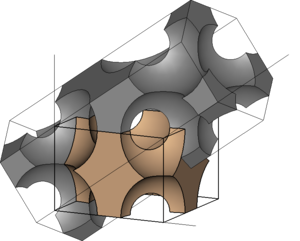

.. image:: https://circleci.com/gh/L-Nafaryus/anisotropy/tree/devel.svg?style=svg&circle-token=423bc964a997ded671ebd4ceacc25f9967acdffa
    :target: https://circleci.com/gh/L-Nafaryus/anisotropy/tree/devel

anisotropy
==========

*anisotropy* is a ``Python`` package that is the result of science-research work 
on the anisotropy of permeability in the periodic porous media. 
A project uses own wrappers around external applications 
for constructing a shapes and meshes (``Salome``) and computing a flow (``OpenFOAM``).

    

.. figure:: static/simple.png
    :align: center
    :alt: 

.. contents:: README contents

Dependencies
============

.. csv-table::
    :header: "Software", "Used version", "Recommended version"

    "`Python <https://www.python.org>`_", "3.9.6", ">= 3.8"
    "`Salome <https://www.salome-platform.org>`_", "9.7.0", ">= 9.6.0"
    "`OpenFOAM <https://www.openfoam.com>`_", "v2012", ""

.. Installation

.. include:: INSTALL.rst

Getting Started
===============

Initializing a new anisotropy project
~~~~~~~~~~~~~~~~~~~~~~~~~~~~~~~~~~~~~

To create a new anisotropy project, you'll use the ``anisotropy init`` command.
``anisotropy init`` is a one-time command you use during the initial setup of a new project.

Example:

.. code-block:: bash

    $ mkdir ~/aproject
    $ cd ~/aproject
    $ anisotropy init

Executing this command will create a new ``anisotropy.db``, ``anisotropy.toml`` files in your
current working directory. This will also create ``build`` and ``logs`` directories for output files.

Database ``anisotropy.db`` is used for storing current values and results. 
With ``anisotropy.toml`` you can configure all an initial values.

Computing
~~~~~~~~~

To start a computation, you'll use the ``anisotropy compute`` command. Using flag ``--stage`` you can
control what you need to compute (mesh or flow). Using flag ``--param`` you can specify which 
structure/direction/theta you need to compute.

Example:

.. code-block:: bash

    $ anisotropy compute --stage mesh --param type=simple --param direction="[1.0, 0.0, 0.0]" --param theta=0.01

.. attention::

    * You can't compute a flow without mesh (if you didn't it before succesfully).
    * ``type``, ``direction`` and ``theta`` are control parameters. If you aren't specifying it than default range of values will be used from ``anisotropy.toml``.

Post-processing
~~~~~~~~~~~~~~~

To use post-processing tools, you'll use the ``anisotropy postprocessing`` command.

Example:

.. code-block:: bash

    $ anisotropy postprocessing permeability

Additional help
~~~~~~~~~~~~~~~

You always can use ``--help`` flag with any of ``anistropy`` command to get more information.

License
=======

GNU GPLv3

For more information see ``LICENSE``.
