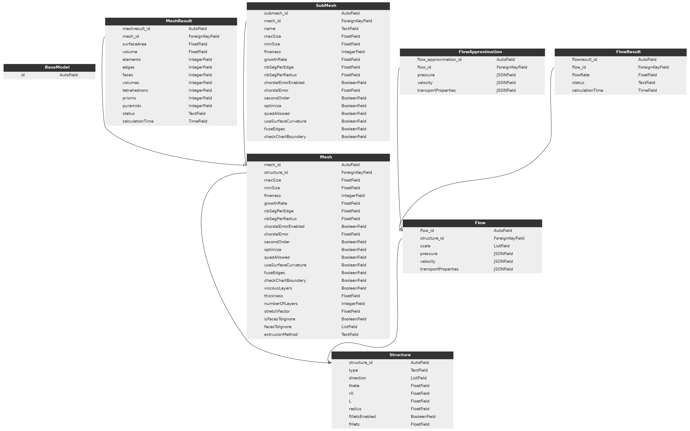

Database hierarchy
==================

Current anisotropy database hierarchy:

peewee migration
----------------

Example of Sqlite database migration and etc:

.. code-block:: python

    from playhouse.migrate import SqliteMigrator, migrate
    from peewee import SqliteDatabase, FloatField

    db = SqliteDatabase("anisotropy.db")
    migrator = SqliteDatabase(db)

    migrate(
        migrator.rename_column("MeshResult", "status", "meshStatus"),
        migrator.add_column("FlowResult", "porosity", FloatField(null = True))
    )
